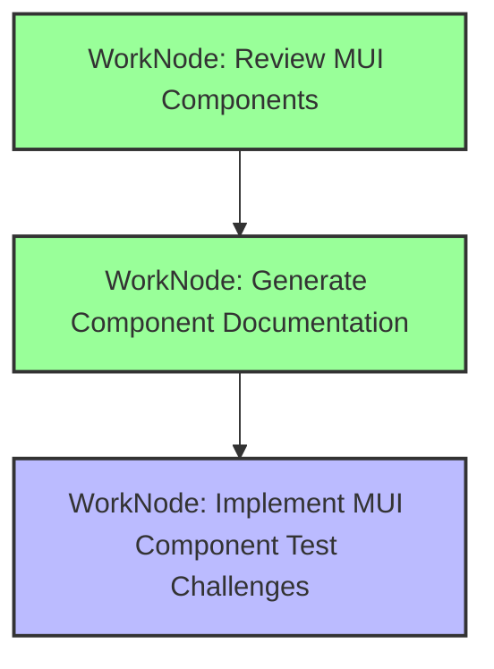

# Workplan for MUI Component Testing Benchmark

## Progress Summary

- **Completed**: 2/3 work nodes (67%)
- **In Progress**: 0 work nodes
- **Pending**: 1 work node (33%)

### Achievements:
1. ✅ Successfully reviewed and categorized 70+ MUI components
2. ✅ Created comprehensive documentation with code examples (1510+ lines)
3. ✅ Added practical React/JSX code examples for key components
4. ✅ Established testing considerations and complexity levels

### Next Steps:
1. Implement comprehensive MUI component test challenges with organized structure and index

## Workplan Graph

---

### WorkNode: Review MUI Components

#### Status

COMPLETED

#### Type

GOOD

#### Input

> Review all available UI components in https://mui.com/material-ui/all-components/

#### End State

> A comprehensive understanding of all MUI components available for testing, including their properties, behaviors, and testing considerations. This information will be used as the foundation for creating test challenges.

#### Milestones

> 1. Access MUI components documentation
> 2. Identify all testable UI components
> 3. Categorize components by complexity and type
> 4. Note key properties and behaviors for each component

#### Dependencies

> None

#### Relevant Files

> - External: https://mui.com/material-ui/all-components/

---

### WorkNode: Generate Component Documentation

#### Status

COMPLETED

#### Type

GOOD

#### Input

> Generate a doc with all testable UI components

#### End State

> A comprehensive markdown document listing 70+ MUI components organized into 8 categories (Input, Data Display, Feedback, Surface, Navigation, Layout, Utility, Lab), with detailed testable properties, code examples, and testing considerations. The document includes practical React/JSX code examples for key components.

#### Milestones

> 1. ✓ Create documentation structure with 8 component categories
> 2. ✓ List all 70+ components with their categories
> 3. ✓ Document testable properties for each component
> 4. ✓ Include code examples for key components (Autocomplete, Button, Checkbox, Select, Switch, TextField, Slider, Avatar, Badge, Chip, Typography, List, Table, Alert, Dialog, Snackbar)
> 5. ✓ Add testing considerations and complexity levels

#### Dependencies

> - WorkNode: Review MUI Components

#### Relevant Files

> - legwork/benchmark_agent/testable-components.md (created with 1510+ lines)

---

### WorkNode: Implement MUI Component Test Challenges

#### Status

PENDING

#### Type

EXCELLENT

#### Input

> Create a comprehensive test challenge system for all MUI components documented in testable-components.md, including directory structure, individual component challenges, and an updated index page

#### End State

> A complete MUI component testing framework with:
> - Organized directory structure matching the 8 component categories
> - 70+ individual challenge files implementing test scenarios for each MUI component
> - Updated challenge.html index with categorized navigation, search functionality, and test result tracking
> - Each challenge is self-contained, follows the code examples from testable-components.md, and tests key component behaviors

#### Milestones

> **Phase 1: Structure Setup**
> 1. Create subdirectories for each component category (inputs/, data-display/, feedback/, surfaces/, navigation/, layout/, utils/, lab/)
> 2. Set up base challenge template with MUI and React imports
> 3. Create a component test harness for consistent testing
> 4. Add README with challenge creation guidelines
>
> **Phase 2: Component Implementation**
> 5. Create challenge files for 15 input components (Button, TextField, Select, Checkbox, Switch, Radio, Slider, etc.)
> 6. Create challenge files for 9 data display components (Avatar, Badge, Chip, List, Table, Typography, etc.)
> 7. Create challenge files for 6 feedback components (Alert, Dialog, Snackbar, Progress, Skeleton, etc.)
> 8. Create challenge files for 4 surface components (Accordion, AppBar, Card, Paper)
> 9. Create challenge files for 9 navigation components (Tabs, Stepper, Drawer, Menu, Pagination, etc.)
> 10. Create challenge files for 5 layout components (Box, Container, Grid, Stack, ImageList)
> 11. Create challenge files for utility and lab components
>
> **Phase 3: Index Integration**
> 12. Update HTML structure to accommodate 70+ component challenges
> 13. Add categorized navigation menu matching the 8 component categories
> 14. Include all challenge scripts with proper loading order
> 15. Add search/filter functionality for finding specific components
> 16. Implement test result display and status tracking
> 17. Test that all challenges load and run correctly

#### Dependencies

> - WorkNode: Generate Component Documentation

#### Relevant Files

> - legwork/benchmark_agent/Challenge/src/ (directory structure)
> - legwork/benchmark_agent/Challenge/src/inputs/*.html (15 files)
> - legwork/benchmark_agent/Challenge/src/data-display/*.html (9 files)
> - legwork/benchmark_agent/Challenge/src/feedback/*.html (6 files)
> - legwork/benchmark_agent/Challenge/src/surfaces/*.html (4 files)
> - legwork/benchmark_agent/Challenge/src/navigation/*.html (9 files)
> - legwork/benchmark_agent/Challenge/src/layout/*.html (5 files)
> - legwork/benchmark_agent/Challenge/src/utils/*.html (8 files)
> - legwork/benchmark_agent/Challenge/src/lab/*.html (3 files)
> - legwork/benchmark_agent/Challenge/challenge.html (updated index)
> - legwork/benchmark_agent/Challenge/src/README.md (guidelines)